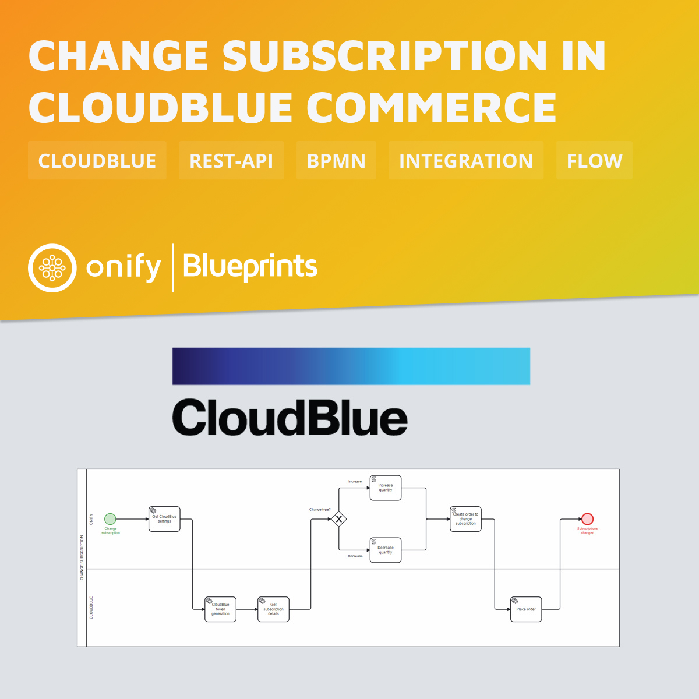

[](https://www.repostatus.org/#wip)


# Onify Blueprint: Change subscription in CloudBlue Commerce

## About 

### About CloudBlue

[CloudBlue](https://www.cloudblue.com) is a SaaS company that is helping businesses transform themselves, whatever their position in the supply chain. They provide a managed marketplace platform that takes the complexity out of distributing subscription- based solutions in the everything-as-a-service world.
[CloudBlue Commerce](https://www.cloudblue.com/commerce/) is multi-tier commerce platform that allows companies to build marketplaces.

> Also checkout https://github.com/cloudblue.

### About this Blueprint

This Blueprint increases or decreases product quantity for a specific subscription via CloudBlue REST-API. I only works if you have one product per subscription! If you have multiple products in the same subscription, only the first will be updated.

> Note: The provisioning of licenses is async and you are not allowed to update a subscription that is currently in provisioning mode.



## Requirements

* [Onify Hub](https://github.com/onify/install)
* [Camunda Modeler](https://camunda.com/download/modeler/)
* [CloudBlue Commerce](https://www.cloudblue.com/commerce/)

## Included

* 1 x Flow (BPMN)

## Setup

### CloudBlue Commerce

[Follow these instructions to get a API Subscription Key](https://kb.cloud.im/support/solutions/articles/66000489946-how-to-get-cloud-marketplace-api-subscription-key).

> For more information about the CloudBlue Commerce API, please see https://apidocs.cloud.im/1.8/howto/ready.

### Onify

Add the following settings in Onify.

|Key|Name|Value|Type|Tag|Role|Description|
|---|----|-----|----|---|----|-----------|
|cloudblue_baseurl|CloudBlue Base URL|`<BASEURL>`|string|cloudblue, frontend|admin|The Base URL for the API, eg. `https://api.cloud.im/marketplace/eu`|
|cloudblue_marketplace|CloudBlue Marketplace|`<MARKETPLACE>`|string|cloudblue, frontend|admin|The short name for the commercial marketplace, eg. `se`|
|cloudblue_subscriptionkey|CloudBlue Subscription Key|`<KEY>`|password|cloudblue, frontend|admin|Subscription to API services that contains certain limits on the API usage, for example, it defines the upper limit on the number of requests your system can send per a period of time. |
|cloudblue_username|CloudBlue Username|`<USERNAME>`|string|cloudblue, frontend|admin|Username is the login name to authenticate your system.|
|cloudblue_password|CloudBlue Password|`<PASSWORD>`|password|cloudblue, frontend|admin|Password for the user|

> Note: Creating settings via admin interface add a trailing `_` in key. This is required for flow to work.

## Deploy

1. Open the BPMN diagram in Camunda Modeler.
2. Deploy the BPMN diagram (click `Deploy current diagram` and follow the steps).

## Run

This workflow should be run as a _adhoc workflow_ and can be part of another process.
Here is an example how to get a secret using a simple `curl` command.

### Variables

* `subscriptionId` - The id for the subscription
* `poNumber` - Purchase order number (optional)
* `changeType` - `increase` or `decrease` the quantity 
* `units` - Units to either increase or decrease product quantity

### Example request 

```bash
curl -X 'POST' \
  '{url}/api/v2/my/workflows/run/cloudblue-commerce-change-subscription?timeout=180' \
  -H 'accept: application/json' \
  -H 'authorization: {auth-token}' \
  -H 'Content-Type: application/json' \
  -d '{
 "subscriptionId": 123456,
 "poNumber": "9999",
 "changeType": "increase",
 "units" : 1
}'
```

> Note: It can take more than 60 seconds for the order request, so make sure you increase default timeout.

### Error responses

#### Timeout for CloudBlue

It seems that sometime CloudBlue times out...

```json
{
  "output": "<html>\r\n<head><title>504 Gateway Time-out</title></head>\r\n<body>\r\n<center><h1>504 Gateway Time-out</h1></center>\r\n<hr><center>nginx</center>\r\n</body>\r\n</html>\r\n",
  "status": {
    "statuskey": "complete"
  }
}
```

#### changeType incorrect

```json
{
  "statusCode": 502,
  "message": "<changeType> no conditional flow taken",
  "error": {
    "message": "<changeType> no conditional flow taken"
  }
}
```

#### Subscription not found

```json
{
  "statusCode": 404,
  "message": "Response code 404 (Not Found)",
  "error": {
    "message": "Response code 404 (Not Found)"
  }
}
```

#### If provisioning already in progress

```json
{
  "output": {
    "correlationId": "a8n-54bc6dc3-f496-84c7-dfe9-f459db8564b3",
    "status": 500,
    "message": "Cannot Upgrade/Downgrade Resources for Subscription #123456: there is already an Upgrade/Downgrade Order #CH009999 in status Provisioning is in progress(LO). This order prohibits placing an order of the same order type (per subscription). Please either cancel conflicting order or wait until it is processed by the system.",
    "path": "/orders",
    "timeStamp": "2023-02-22T07:45:08.223+00:00"
  },
  "status": {
    "statuskey": "complete"
  }
}
```

## Support

* Community/forum: https://support.onify.co/discuss
* Documentation: https://support.onify.co/docs
* Support and SLA: https://support.onify.co/docs/get-support

## License

This project is licensed under the MIT License - see the [LICENSE](LICENSE) file for details.